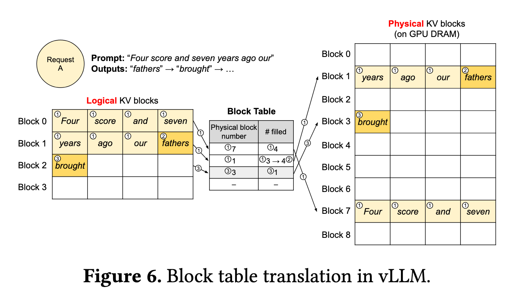
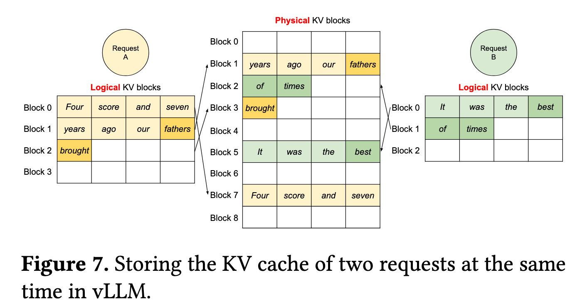
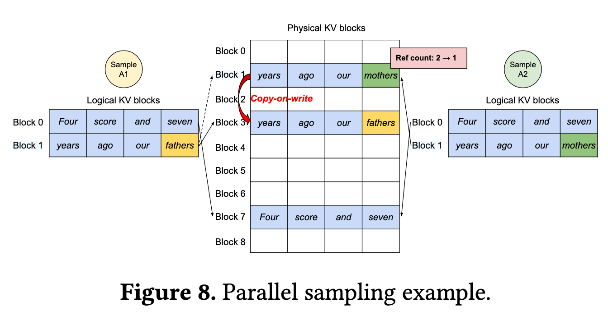
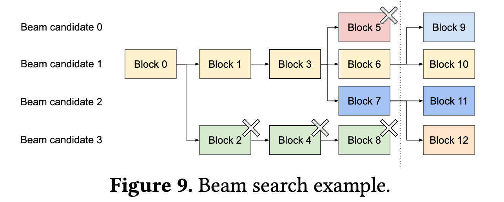

# KV Cache Memory Notes

## 1. KV Cache 公式

```plaintext
KV Cache bytes =  2 * bytes_per_element * batch_size * seq_len * num_layers * num_kv_heads * head_dim
```

这个公式是正确的，计算的是理想 KV tensor 大小：

- `2` 表示同时缓存 K 和 V。
- `seq_len` 表示已经缓存的 token 数，通常是 prompt tokens + 已生成 tokens。
- 如果是 GQA / MQA，应该使用 `num_kv_heads`，不是 `num_attention_heads`。
- 这个值不包含 vLLM block 对齐、allocator 预留、block table、CUDA graph buffer 等额外开销。

## 2. 参数解释

<table>
  <tr><th>参数</th><th>含义</th><th>对显存影响</th></tr>
  <tr><td>bytes_per_element</td><td>FP16/BF16=2, FP32=4</td><td>线性增长</td></tr>
  <tr><td>batch_size</td><td>同时服务的请求数</td><td>线性增长</td></tr>
  <tr><td>seq_len</td><td>每个请求上下文长度</td><td>线性增长</td></tr>
  <tr><td>num_layers</td><td>Transformer 层数</td><td>线性增长</td></tr>
  <tr><td>num_kv_heads</td><td>K/V head 数</td><td>线性增长</td></tr>
  <tr><td>head_dim</td><td>每个 head 的维度</td><td>线性增长</td></tr>
</table>

## 3. 示例计算

以Qwen3-7B模型为例，下面是参数列表：

```plaintext
Qwen3-7B:

layers = 28
Q heads = 28
KV heads = 8
head_dim = 128
hidden_size = 3584

默认非量化推理精度：通常是 BF16
```

seq_len=1024，batch=50 时

```plaintext
KV Cache Size = 2 * 2 * 50 * 1024 * 28 * 8 * 128
= 5,872,025,600 bytes
= 5.872 GB
```

## 4. PagedAttention 理解

一种优化 KV Cache 内存分配和共享的技术

核心优势：

1、near-zero 内存浪费

2、请求内以及跨请求的 Cache 共享

核心思想：

每个 request 看到的是 logical block，通过 block table 映射到 physical block，physical block 则由 GPU memory manager 负责分配管理。

基础 decode 流程中，一个包含 7 个token 的inputs，将依次从左到右填充 2 个 block，logical block 是连续的，而 physical block 可能是不连续的。block table 会记录 logical -> physical 的映射，以及 block filled 的数量。当新的 cache 产生时，连续向后追加，如果当前块已满，会写到新 block 中，logical 的 block 是连续的，physical 不一定和上一个块连续。



拓展场景：

Parallel sampling，同时产生多个输出，会复用输入 promt，通过 refcount 标记 physical block 映射到了几个 logical block，当输出需要写入新的 token 时，如果 refcount > 1，复制一份再写入，如果 refcount = 1，直接写入，这就是 copy-on-write 技术。



Beam search：

和 Parallel sampling 不同的是，这种解码方法同时存在多个 candidate 路径，每个 candidate 路径都可能复用前面已经计算过的 block，而不仅仅复用输入。这种 block 共享解决了当前系统会在不同 candidate 之间拷贝 cache 的问题。



Shared prefix

可以用于使用系统提示词的应用，这种应用会将系统提示词和用户输入 concat 到一起作为 promt，可以给系统提示词部分分配 cache，这样每次计算就可以只算用户输入部分。

一些实现细节：

1、以 block 为基本内存存储单元 （contain 16、32 token），块之间实现非连续存储

2、逻辑上，block 的 layout 是 [block_size, kv_head_nums, head_dims] for keys/values。而实际物理上匹配硬件特性，将 layout 构造为：

keys：[num_blocks, num_kv_heads, head_size/x, block_size, x]

values：[num_block, num_kv_heads, head_size, block_size]
